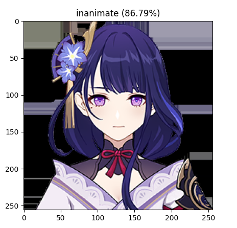

# Inanimate & Animate Object Classifier with Few-shot Method

## Installation
### Clone this repo
```bash
git clone https://github.com/zogojogo/inanimate-fewshot.git
```
### Download dependencies
```bash
pip install -r requirements.txt
```
## Usage
### Run with Python
```bash
python3 test.py --help
usage: test.py [-h] --img IMG

optional arguments:
  -h, --help  show this help message and exit
  --img IMG   Input image path

# Example input
python3 test.py --img test/anim1.jpg
```

## Result
Acquire 100% accuracy with 11 query images in test folder. Here is the result examples.

### Animate


### Inanimate
